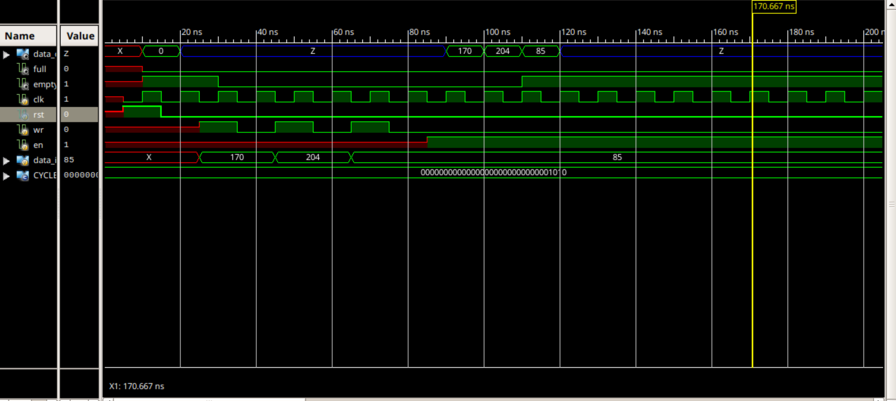

# FIFO (First-In-First-Out) Buffer in Verilog

## 📌 Project Overview
This project implements a **FIFO (First-In-First-Out) buffer** in Verilog HDL.  
A FIFO is a sequential storage device that stores data in the order it is written and retrieves it in the same order.  
The design is tested using a Verilog testbench and verified through simulation.

## 📂 Repository Contents
- `fifo.v` → RTL design file for the FIFO buffer  
- `fifo_tb.v` → Testbench for verifying FIFO functionality  
- `docs/waveform.png` → Simulation waveform (to be added)  
- `README.md` → Project documentation  

## ⚙️ Functionality
- Supports **write** and **read** operations  
- Provides **full** and **empty** status flags  
- Stores and retrieves data in sequential order (FIFO principle)  
- Parameterized depth (number of entries) and data width can be modified easily  

## 🧪 Simulation
- The design is simulated using **ISim** (Xilinx ISE) or any Verilog simulator.  
- Testbench applies write and read operations under different conditions.  
- Full and empty flags are verified during simulation.  

### ✅ Waveform Result
Simulation waveform will be displayed here once added:

## 🚀 How to Run
1. Open **Xilinx ISE**, **ModelSim**, or any Verilog simulator.  
2. Add both `fifo.v` and `fifo_tb.v` to the project.  
3. Run behavioral simulation.  
4. Observe data writes, reads, and flag outputs in the waveform.  

## 📜 License
This project is open-source under the MIT License.  
You are free to use, modify, and distribute it for educational purposes.
